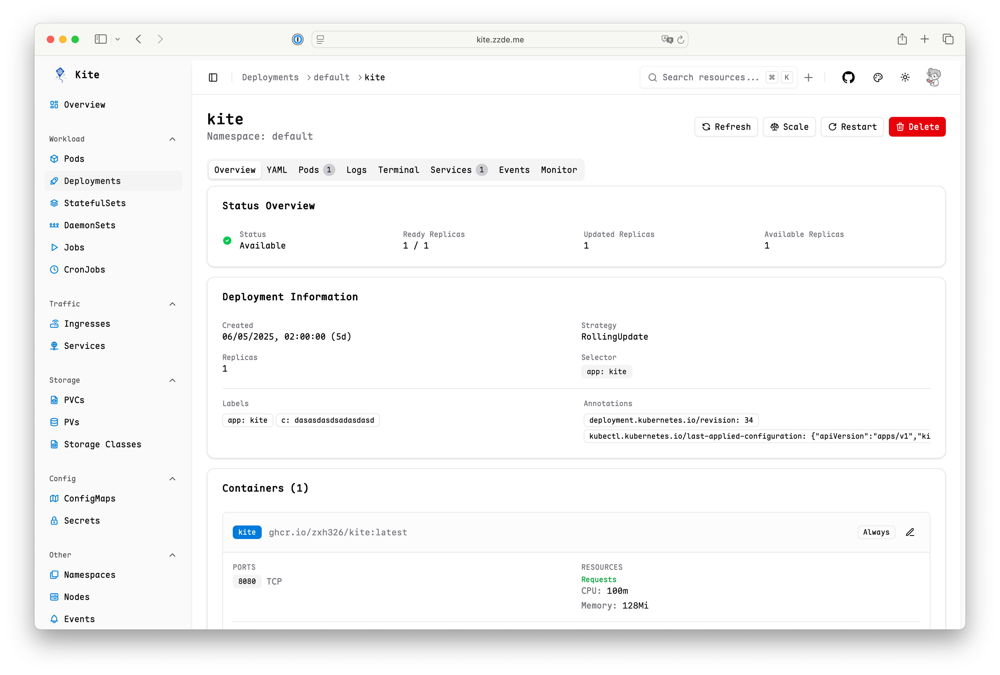
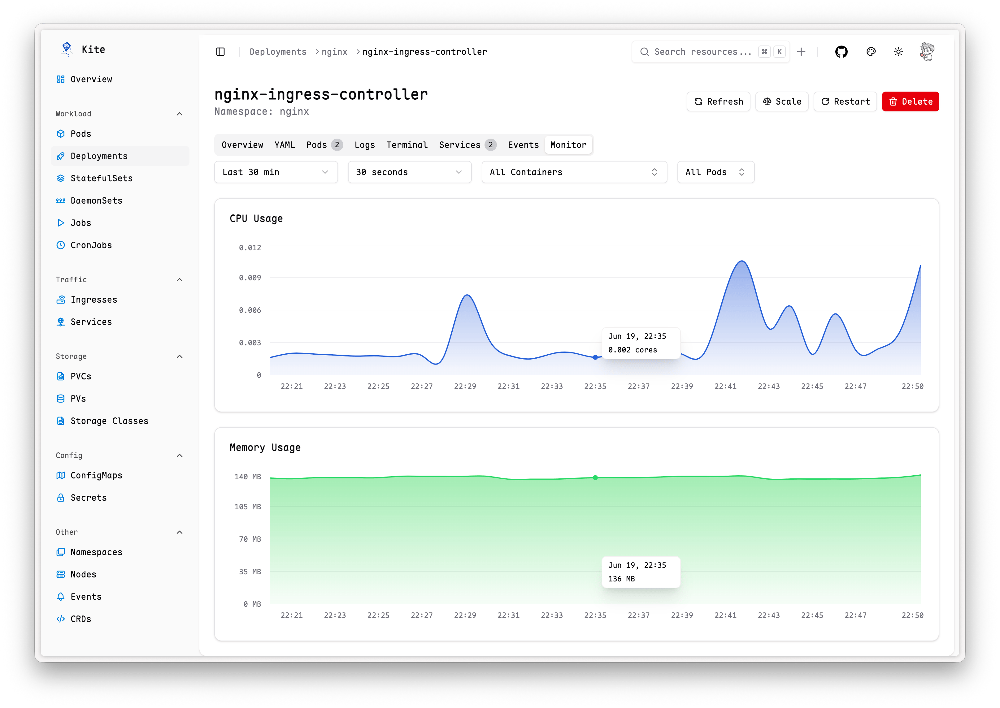
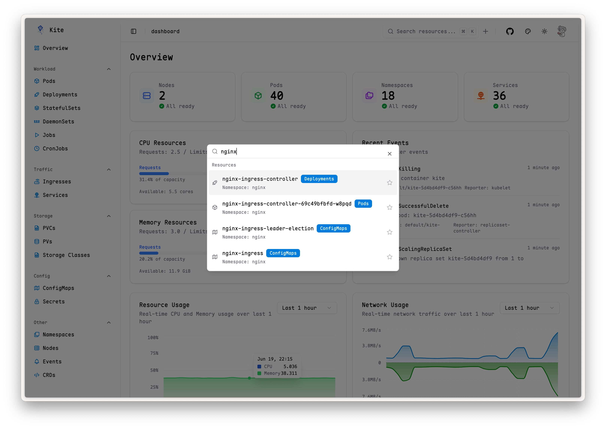

# Kite - Modern Kubernetes Dashboard

<div align="center">


_A modern, intuitive Kubernetes dashboard_

[](https://golang.org)
[](https://reactjs.org)
[](https://www.typescriptlang.org)
[](LICENSE)

</div>

Kite is a lightweight, modern Kubernetes dashboard that provides an intuitive interface for managing and monitoring your Kubernetes clusters. It offers real-time metrics, comprehensive resource management, multi-cluster support, and a beautiful user experience.

---

## 📸 Screenshots

### 🏠 Dashboard Overview


_Comprehensive cluster overview with real-time metrics and resource statistics_

<details>

<summary>More screenshots</summary>

### 🚀 Resource Management


_Detailed deployment view with pod management and status monitoring_

### 📊 Real-time Monitoring


_Real-time CPU, memory, and network usage charts with historical data_

### 🔍 Global Search


_Powerful search functionality across all Kubernetes resources_

### 📋 Live Logs


_Real-time log streaming with filtering and search capabilities_

### 💻 Web Terminal


_Execute commands directly in pods through the browser interface_

### 🔐 OAuth Authentication


_Secure authentication with GitHub and custom OAuth providers_

</details>

---

## ✨ Features

### 🎯 **Modern User Experience**

- 🌓 **Multi-Theme Support** - Dark/light/color themes with system preference detection
- 🔍 **Advanced Search** - Global search with across all resources

### 🏘️ **Multi-Cluster Management**

- 🔄 **Seamless Cluster Switching** - Switch between multiple Kubernetes clusters with a single click
- 📊 **Per-Cluster Monitoring** - Independent Prometheus configuration for each cluster
- ⚙️ **Kubeconfig Integration** - Automatic discovery of clusters from your kubeconfig file

### 🔍 **Comprehensive Resource Management**

- 📋 **Full Resource Coverage** - Pods, Deployments, Services, ConfigMaps, Secrets, PVs, PVCs, and more
- 📄 **Live YAML Editing** - Built-in Monaco editor with syntax highlighting and validation
- 📊 **Detailed Resource Views** - In-depth information with containers, volumes, events, and conditions
- 🔗 **Resource Relationships** - Visualize connections between related resources (e.g., Deployment → Pods)
- ⚙️ **Resource Operations** - Create, update, delete, scale, and restart resources directly from the UI
- 🔄 **Custom Resources** - Full support for CRDs (Custom Resource Definitions)
- 🏷️ **Quick Image Tag Selector** - Easily select and change container image tags based on Docker and container registry APIs

### 📈 **Monitoring & Observability**

- 📊 **Real-time Metrics** - CPU, memory, and network usage charts powered by Prometheus
- 📋 **Cluster Overview** - Comprehensive cluster health and resource statistics
- 📝 **Live Logs** - Stream pod logs in real-time with filtering and search capabilities
- 💻 **Web Terminal** - Execute commands directly in pods through the browser

### 🔐 **Authentication**

- 🛡️ **OAuth Integration** - Support for GitHub and custom OAuth providers
- 🔑 **Username/Password** - Simple authentication using environment variables
- 🔒 **Role Based Access Control** - Fine-grained access control for users and groups

---

## 🚀 Quick Start

### Environment Variables

| Variable                   | Description                                                                               | Default                       | Required |
| -------------------------- | ----------------------------------------------------------------------------------------- | ----------------------------- | -------- |
| `PORT`                     | Server port                                                                               | `8080`                        | No       |
| `KUBECONFIG`               | Kubernetes config path for multi-cluster access                                           | `inCluster or ~/.kube/config` | No       |
| `ENABLE_ANALYTICS`         | Enable anonymous usage analytics                                                          | `false`                       | No       |
| `PROMETHEUS_URL`           | Default Prometheus server URL [Prometheus Setup Guide](docs/PROMETHEUS_SETUP.md)          | `-`                           | No       |
| `<CLUSTER>_PROMETHEUS_URL` | Cluster-specific Prometheus URL (see Multi-Cluster section below)                         | `-`                           | No       |
| `JWT_SECRET`               | JWT secret for signing tokens. default is random string                                   | `random string`               | No       |
| `OAUTH_ENABLED`            | Enable OAuth authentication. [OAuth Setup Guide](docs/OAUTH_SETUP.md).                    | `false`                       | No       |
| `KITE_USERNAME`            | Username for basic authentication. If set, enables password auth. default has viewer role | `-`                           | No       |
| `KITE_PASSWORD`            | Password for basic authentication. If set, enables password auth.                         | `-`                           | No       |
| `ROLES_CONFIG_PATH`        | Path to the roles configuration file.                                                     | `/config/roles.yaml`          | No       |

### Docker

To run Kite using Docker, you can use the pre-built image:

> NOTE: examle role config all users has viewer perminsion

> See [Roles Configuration](docs/ROLES_CONFIG.md) for more details on configuring roles and permissions.

```bash
# download example roles config
wget https://raw.githubusercontent.com/zxh326/kite/refs/heads/main/docs/roles.yaml
docker run --rm -p 8080:8080 -v ./roles.yaml:/config/roles.yaml -v ~/.kube/config:/home/nonroot/.kube/config ghcr.io/zxh326/kite:latest
```

### Deploy in Kubernetes

#### Using Helm (Recommended)

1. **Add Helm repository**

   ```bash
   helm repo add kite https://zxh326.github.io/kite
   helm repo update
   ```

2. **Install with default values**

   ```bash
   helm install kite kite/kite -n kube-system
   ```

#### Using kubectl

1. **Apply deployment manifests**

   ```bash
   kubectl apply -f deploy/install.yaml
   # or install it online
   kubectl apply -f https://raw.githubusercontent.com/zxh326/kite/refs/heads/main/deploy/install.yaml
   ```

2. **Access via port-forward**

   ```bash
   kubectl port-forward -n kube-system svc/kite 8080:80
   ```

### Build from Source

#### 📋 Prerequisites

1. **Clone the repository**

   ```bash
   git clone https://github.com/zxh326/kite.git
   cd kite
   ```

2. **Build the project**

   ```bash
   make deps
   make build
   ```

3. **Run the server**

   ```bash
   make run
   ```

---

## 🔍 Troubleshooting

### Common Issues

**1. Multi-cluster access issues**

Ensure your kubeconfig file is correctly set up and accessible. You can specify the path using the `KUBECONFIG` environment variable.

**2. Prometheus metrics not available**

see [Prometheus Setup Guide](docs/PROMETHEUS_SETUP.md) for configuring Prometheus and kube-state-metrics.

**3. OAuth authentication issues**

see [OAuth Setup Guide](docs/OAUTH_SETUP.md) for troubleshooting OAuth configuration.

**4. Role Based Access Control (RBAC) issues**

Ensure your `roles.yaml` file is correctly configured and applied. You can check the logs for any RBAC-related errors.

See [Roles Configuration](docs/ROLES_CONFIG.md) for more details on configuring roles and permissions.

**4.1. How to manage RBAC rules in the UI?**

As you know, kite is a lightweight Kubernetes dashboard designed to provide simple cluster management features. It does not require any external dependencies. If RBAC management functionality is added to the UI, at least one DB is needed to store RBAC rules, which would make kite more complex. As of now, we do not plan to introduce such features.

**5. Analytics issues**

By default, kite will not collect any analytics data.

If you wish to help improve the product, you can set the environment variable `ENABLE_ANALYTICS=true`.

kite will use `umami` to collect very little anonymous usage.

source code is available at [Analytics](https://github.com/zxh326/kite/blob/main/pkg/utils/utils.go#L10-L16)

**6. Custom font**

build kite with `make build` and change the font in `./ui/src/index.css`

```css
@font-face {
  font-family: "Maple Mono";
  font-style: normal;
  font-display: swap;
  font-weight: 400;
  src: url(https://cdn.jsdelivr.net/fontsource/fonts/maple-mono@latest/latin-400-normal.woff2)
      format("woff2"), url(https://cdn.jsdelivr.net/fontsource/fonts/maple-mono@latest/latin-400-normal.woff)
      format("woff");
}

body {
  font-family: "Maple Mono", var(--font-sans);
}
```
